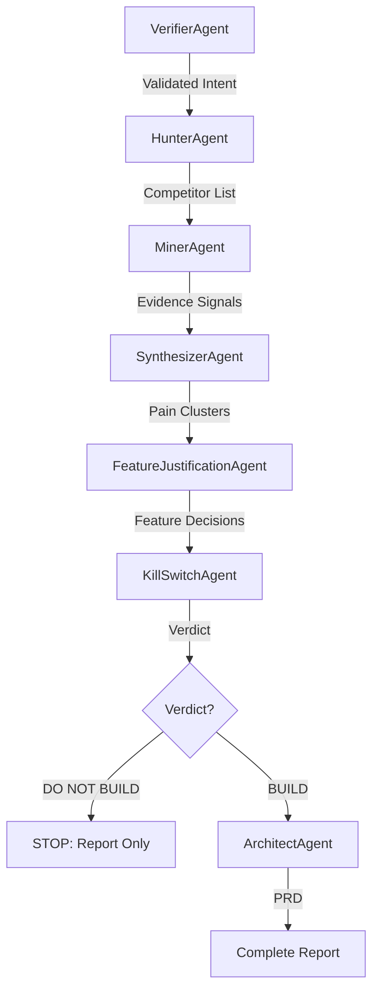

# System Architecture: DecideKit

## 1. System Purpose

The system is an **AI-powered Product Discovery and Decision Engine** that transforms messy signals (ideas, URLs, competitors, observations) into a defensible **BUILD / DO NOT BUILD** decision, and—only if warranted—a PM-grade PRD.

It is explicitly designed to:
*   Prevent founder bias
*   Surface real user pain
*   Stop bad products early
*   Justify every feature with evidence

> **Core Philosophy:** This is not an idea generator. It is a decision system.

## 2. Core Design Principles

1.  **Evidence before ideas**: No features without pain. No pain without evidence.
2.  **Explicit skepticism**: The system is biased toward "NO" unless proven otherwise.
3.  **Lossless early stages, compressive later stages**: Raw evidence is preserved early, synthesized only when necessary.
4.  **Human-grade artifacts**: Outputs must be readable, shareable, and defensible by humans.
5.  **Hard gates, not soft suggestions**: Kill-Switch verdicts stop downstream execution.

## 3. High-Level Flow (Mental Model)

`Signal` → `Evidence` → `Insight` → `Decision` → `PRD` (optional)

*   Only one path leads to a PRD.
*   Most paths should end earlier.

## 4. Execution Flow (Agent Graph)



## 5. Agents (Responsibilities & Contracts)

### 5.1 VerifierAgent — Intent Quality Gate
**Purpose:** Ensure the input is specific enough to research meaningfully.
*   **Input:** Raw user input (idea, phrase)
*   **Output:** Validated or refined problem framing
*   **Guarantee:** Downstream agents never operate on vague intent.

### 5.2 HunterAgent — Market Surface Mapping
**Purpose:** Identify existing solutions related to the problem space.
*   **Input:** Validated intent
*   **Output:** List of competitors (name + URL)
*   **Guarantee:** We don't research in a vacuum.

### 5.3 MinerAgent — Evidence Harvester (Critical Agent)
**Purpose:** Collect raw, multi-source evidence of user pain.
*   **Sources:** Reddit, App store reviews, Complaint forums, Blogs & FAQs, Pricing & onboarding pages.

**Output Contract:**
```json
EvidenceSignal[]
{
  "source_type": "",
  "platform": "",
  "pain_theme": "",
  "pain_description": "",
  "example_evidence": "",
  "impact": "trial_blocker | conversion_blocker | churn | trust_collapse",
  "severity": "low | medium | high | critical",
  "confidence": 0.0
}
```
*   **Guarantee:** No opinions. Only repeated failure signals.

### 5.4 SynthesizerAgent — Insight Compression
**Purpose:** Turn noisy evidence into ranked pain clusters.

**Output Contract:**
```json
PainCluster[]
{
  "cluster_id": "",
  "cluster_name": "",
  "description": "",
  "affected_personas": [],
  "evidence_count": 0,
  "platforms_affected": [],
  "impact_summary": {
    "trial_blocker": true,
    "conversion_blocker": true,
    "trust_collapse": false
  },
  "severity": "low | medium | high | critical",
  "why_users_get_angry": "",
  "representative_quotes": []
}
```
*   **Guarantee:** Only structural problems survive.

### 5.5 FeatureJustificationAgent — Scope Gatekeeper
**Purpose:** Decide what features deserve to exist.

**Output Contract:**
```json
FeatureDecision[]
{
  "feature_id": "",
  "feature_name": "",
  "solves_pain_clusters": [],
  "user_problem": "",
  "why_existing_solutions_fail": "",
  "mvp_priority": true,
  "expected_user_outcome": "",
  "success_metric": "",
  "if_we_dont_build": "",
  "complexity": "low | medium | high"
}
```
**Rules:**
*   One feature per pain cluster.
*   No feature without a metric.
*   MVP excludes high-complexity unless unavoidable.

### 5.6 KillSwitchAgent — Hard NO / YES Decision
**Purpose:** Stop bad products before time is wasted.

**Output Contract:**
```json
KillSwitchVerdict
{
  "verdict": "BUILD | DO_NOT_BUILD",
  "confidence": 0.0,
  "primary_reason": "",
  "supporting_reasons": [],
  "failed_criteria": [],
  "what_would_change_verdict": [],
  "recommendation": "Proceed | Pivot | Abandon"
}
```
**Rules:**
*   ≥2 critical failures → DO_NOT_BUILD
*   Optimism is forbidden.
*   Verdict is final.

### 5.7 ArchitectAgent — PRD Generator (Conditional)
**Purpose:** Produce a PM-grade PRD only if Kill-Switch passes.

**Output Contract:**
```json
PRD
{
  "product_overview": {},
  "goals": [],
  "non_goals": [],
  "mvp_features": [],
  "user_flow": [],
  "risks_and_unknowns": [],
  "launch_scope": {},
  "success_definition": {}
}
```
*   **Guarantee:** Every feature is justified. Scope is explicit.

## 6. State Model (Single Source of Truth)

`ResearchState` carries the system end-to-end.

**Key fields:**
*   `competitors`
*   `evidence_signals`
*   `pain_clusters`
*   `feature_decisions`
*   `kill_switch`
*   `prd`

This allows for **resumability**, **HITL checkpoints**, and **auditability**.

## 7. Report Generator (Human Artifact Layer)

**Purpose:** Render the reasoning chain into a readable Markdown report.

**Structure:**
1.  Executive Verdict
2.  Evidence Summary
3.  Pain Clusters
4.  Feature Decisions
5.  Kill-Switch Analysis
6.  PRD (only if BUILD)

*   **Guarantee:** A DO_NOT_BUILD report still feels complete and valuable.

## 8. What the System Does NOT Do (By Design)

*   ❌ No hype validation
*   ❌ No roadmap guessing
*   ❌ No pricing optimization
*   ❌ No GTM automation
*   ❌ No “AI copilot” inside the product

*Those come after conviction.*

## 9. System Distinctiveness

*   It can say **NO**.
*   It treats time as the scarce resource.
*   It produces defensible artifacts.
*   It mirrors real PM / investor thinking.
*   It scales from solo founder → team.

> Most tools generate ideas. This system kills bad ones and sharpens good ones.

#### In c:\Users\patha\_Personal\CodeRepos\idea_hunter
`cd backend`
`pip install -r requirements.txt`
`python -m uvicorn api:app --reload --port 8000`

#### In c:\Users\patha\_Personal\CodeRepos\idea_hunter\frontend
`npm install`
`npm run dev`